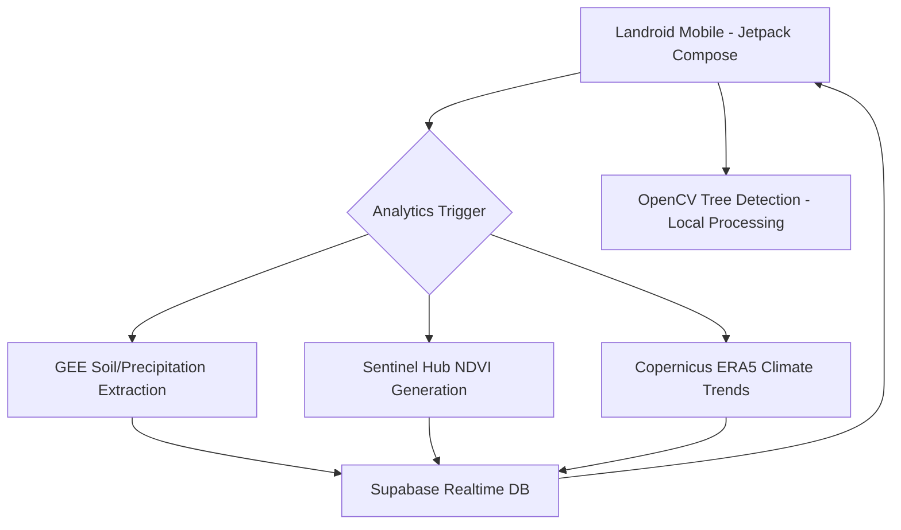

# Landroid - Intelligent Farm Analytics & Management

**Landroid** is a cutting-edge Android application built specifically to revolutionize agricultural data processing, unifying **Land Consultants** and **Landowners** onto a heavily analytical, role-based platform. 

Built using modern **Jetpack Compose** architecture, the app scales rapidly, leveraging localized AI models like **OpenCV** alongside extensive GIS mapping vectors via **MapLibre** to serve real-time agronomic insights onto the palms of landowners.

---

## 🚀 Key Features by Role

### 🛡 Land Consultant (Admin Architecture)
The Command Center designed to create boundaries effectively. 
* **Create Parcels:** Digitize land blocks seamlessly using GEE/MapLibre.
* **Drone Integration:** Upload critical infrastructure maps (Orthomosaic, DEM, NDVI overlays).
* **Document Management Vault:** Upload regulatory framework files safely to AWS/Supabase structures (Patta, FMB, EC Files).
* **Landowner Assignment:** Securely lock and route bounded maps directly to farm operators.

### 🌱 Landowner (Read-Only Consumer Analytics)
The "Asset Portfolio" Dashboard customized for deep-dive analysis.
* **GIS Map Integration:** Native ESRI Satellite integration overlaid with projected boundary zones strictly for their assigned parcels.
* **Dynamic Land Health Score:** Custom tracking UI assessing soil/irrigation signals over targeted acreage.
* **OpenCV Tree Count:** Hardware-accelerated Canopy Detection parsing drone captures.
* **Algorithmic Land Valuation:** Instant calculations extracting the estimated market scope (₹).
* **Plant Zones:** Multi-spectral NDVI classification to track crop saturation.

---

## 🛠 Technology Stack

### **Mobile Engine**
* **Frontend UI:** Kotlin & Jetpack Compose (Material 3)
* **GIS / Mapping SDK:** MapLibre Native (GeoJSON EPSG:4326 Projection & ESRI World Imagery)
* **Computer Vision:** OpenCV (Native C++ Bindings wrapped into Kotlin Flows)
* **Authentication:** Firebase (OTP / Phone Number Protocols / Local Testing Bypass)
* **State Management:** ViewModels, Coroutines, and Hilt/Dagger

### **Analytics Backend**
* **Geospatial Processing Engine:** Google Earth Engine (GEE)
* **Satellite Feeds:** Sentinel Hub V1 Process API
* **Climate Reanalysis:** Copernicus ERA5 (NetCDF Payloads)
* **Infrastructure Mapping:** OpenStreetMap (Overpass API)
* **Storage & Backend-as-a-Service:** Supabase (PostgreSQL & Realtime)

---

## ⚙️ Initial Setup & Build Configuration

To run this application locally, you must assemble the encrypted configurations explicitly since they are tracked in `.gitignore`.

### 1. Supply the `.env` Configuration
At the root `Landroid/`, create a `.env` file containing your Supabase bindings:
```env
SUPABASE_URL=your_project_url
SUPABASE_ANON_KEY=your_secure_anon_key
# Geospatial API Keys
SH_CLIENT_ID=your_sentinel_hub_id
SH_CLIENT_SECRET=your_sentinel_hub_secret
CDS_API_KEY=your_copernicus_era5_key
```

### 2. Provide Firebase Context
Inside `app/`, insert a valid `google-services.json` tied to your Firebase project.
* *Note:* Phone authentication billing walls can be bypassed in development by using the hardcoded `0000000000` payload for OTP challenge.

### 3. Google Earth Engine (GEE) Setup
Ensure you have the Python GEE client authenticated and tied to your GCP project:
```bash
earthengine authenticate --project landroid-708c7
```

### 4. Build and Deployment
The `build.gradle.kts` structure uses KSP and Hilt processors. 
1. Open the project in Android Studio.
2. Sync Gradle and ensure JVM 17+ is configured.
3. Simply Clean, Rebuild, and Deploy onto an emulator or physical device (API 28+ required).

---

## 📊 System Architecture



